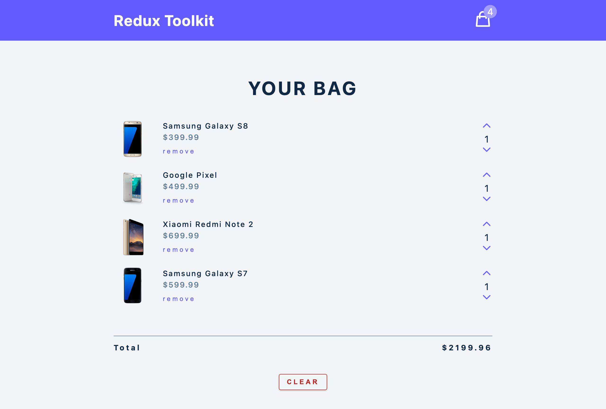

<h1> Redux Toolkit Learning </h1>

<div align="center">
  
</div>

**这个项目通过管理一个购物车中的状态来学习 Redux Toolkit。**

在大型项目中，尤其是团队协作的项目，最大的挑战之一就是状态管理（state management）。在拥有大量功能（feature）的大型项目中，Context API 有其局限性。为了解决这个问题，社区中最 popular 的 state library 是 [Redux](https://redux.js.org/)。

尽管 Redux 解决了很多问题，但它也带来了其他令人头疼的新问题。比如，它需要大量烦人的模板和手动设置，尤其是涉及到高级功能时，需要安装更多的库，就要设置更多的配置。久而久之，尤其当我们必须为每个项目都这样做时，就会变得很烦人。所以需要 Redux Toolkit。Redux Toolkit 相当于带电池的 Redux，它内置了所有常用的额外库和设置，无需额外设置，加快工作效率。

使用 Redux Toolkit，既能获得 Redux 提供的所有好处，还不需要付出额外的劳动。

<h2> Table of Content </h2>

- [Get Started](#get-started)
- [Tool \& Resource](#tool--resource)
  - [Redux Dev Tool](#redux-dev-tool)
  - [Hero Icons](#hero-icons)
- [Redux](#redux)
- [Redux Toolkit](#redux-toolkit)
  - [Docs](#docs)
  - [Install Template ( ❌ )](#install-template---)
  - [Install in Existing App ( ✅ )](#install-in-existing-app---)
    - [@reduxjs/toolkit](#reduxjstoolkit)
    - [Extras](#extras)
    - [react-redux](#react-redux)
- [Setup application with Redux Toolkit](#setup-application-with-redux-toolkit)
  - [Setup Store](#setup-store)
  - [Setup Provider](#setup-provider)
  - [Setup Cart Slice](#setup-cart-slice)
- [Access store value - useSelector](#access-store-value---useselector)
- [First Reducer](#first-reducer)
  - [Action](#action)
  - [Invoke Action - useDispatch](#invoke-action---usedispatch)
- [Modal](#modal)
  - [Prevent body scrolling when modal is open](#prevent-body-scrolling-when-modal-is-open)
- [Setup Asynchronous Functionality with Redux Toolkit](#setup-asynchronous-functionality-with-redux-toolkit)
  - [Important Update!](#important-update)
  - [API](#api)
  - [CreateAsyncThunk](#createasyncthunk)
  - [CreateAsyncThunk with Axios](#createasyncthunk-with-axios)
  - [The extraReducers "builder callback" notation](#the-extrareducers-builder-callback-notation)

## Get Started

1. `npm install`
2. `npm start`

## Tool & Resource

### Redux Dev Tool

在浏览器安装 [Redux Dev Tool](https://chromewebstore.google.com/detail/redux-devtools/lmhkpmbekcpmknklioeibfkpmmfibljd) 插件

### Hero Icons

[Hero Icons](https://heroicons.com/)

1. 把 icon 设置成一个组件
    ```js
    // icons.js

    export const TestIcon = () => {
      return (
        <svg ...>
          <path .../>
        </svg>
      );
    };
    ```
1. 样式
    ```css
      nav svg {
        width: 40px;
        color: var(--clr-white);
      }
      ```

## Redux

Redux is not part of official React, even though they're used together very often.

## Redux Toolkit

### Docs

[Redux Toolkit Docs](https://redux-toolkit.js.org/introduction/getting-started)

### Install Template ( ❌ )

这个方法添加了太多的模板，不推荐使用。

```sh
npx create-react-app my-app --template redux

# @latest
npx create-react-app@latest my-app --template redux
```

### Install in Existing App ( ✅ )

推荐在已经创建好的项目中添加

```sh
npm install @reduxjs/toolkit react-redux
```

#### @reduxjs/toolkit

consists of few libraries

- redux (core library, state management)
- immer (allows to mutate state)
- redux-thunk (handles async actions)
- reselect (simplifies reducer functions)

#### Extras

- redux devtools
- combine reducers

#### react-redux
> Redux can be used with any front-end framework. It's not specific to React. In order to connect our application to the Redux, we use react-redux.

connects our app to redux

## Setup application with Redux Toolkit

### Setup Store

创建 `store.js`
```js
import { configureStore } from '@reduxjs/toolkit';

export const store = configureStore({
  reducer: {}, // in here setting up the features
});
```

### Setup Provider

在 `index.js` 中，导入 `store` 和 `Provider`
```js
// index.js

import React from 'react';
import ReactDOM from 'react-dom';
import './index.css';
import App from './App';
// import store and provider
import { store } from './store';
import { Provider } from 'react-redux';

ReactDOM.render(
  <React.StrictMode>
    <Provider store={store}>
      <App />
    </Provider>
  </React.StrictMode>,
  document.getElementById('root')
);
```

### Setup Cart Slice

1. 把 Slice 想成 Application Feature，设置 Slice 需要：
   1. 创建 `features` 文件夹
   2. 在该文件夹下创建代表 feature 的文件夹比如 `cart`
   3. 在 `feartures/cart`文件夹下创建功能 Slice 的`.js`文件，比如 `cartSlice.js`

    ```js
    // cartSlice.js

    import { createSlice } from '@reduxjs/toolkit';

    const initialState = {
      cartItems: [],
      amount: 0,
      total: 0,
      isLoading: true,
    };

    const cartSlice = createSlice({
      name: 'cart',
      initialState,
    });

    console.log(cartSlice);

    export default cartSlice.reducer;
    ```

2. 在 `store.js` 导入 `cartReducer`，`cartReducer` 是用于控制 Slice 中的状态的函数。
    ```js
    import { configureStore } from '@reduxjs/toolkit';
    import cartReducer from './features/cart/cartSlice';

    export const store = configureStore({
      reducer: {
        cart: cartReducer, // key 的名字 up to you
      },
    });
    ```

## Access store value - useSelector

用 `useSelector` 在任意一个 component 中获取 `store.js` 中的状态值（`initialState`）

```jsx
// Navbar.js
import { CartIcon } from '../icons';
import { useSelector } from 'react-redux';

const Navbar = () => {
  const { amount } = useSelector((state) => state.cart);

  return (
    <nav>
      <div className='nav-center'>
        <h3>redux toolkit</h3>
        <div className='nav-container'>
          <CartIcon />
          <div className='amount-container'>
            <p className='total-amount'>{amount}</p>
          </div>
        </div>
      </div>
    </nav>
  );
};
export default Navbar;
```

## First Reducer

用 `useReducer` 时，总是要返回一个新的状态值，但用 Redux Toolkit 不需要，因为下载 Redux Toolkit 时也下载了 `Immer` 包。`Immer` 包可以让我们以更方便的方式处理状态值。

```js
// cartSlice.js

const cartSlice = createSlice({
  name: 'cart',
  initialState,
  reducers: {
    clearCart: (state) => {
      state.cartItems = [];
    },
  },
});

export const { clearCart } = cartSlice.actions;
```

### Action

使用 useReducer 时，需要像这样手动创建 action：
```js
const ACTION_TYPE = 'ACTION_TYPE';

const actionCreator = (payload) => {
  return { type: ACTION_TYPE, payload: payload };
};
```

但是使用 Redux Toolkit (Immer)，一旦我们创建了 reducer，Immer 会自动根据 reducer 的名字创建 action。

### Invoke Action - useDispatch

用 useDispatch 来调用 action

```js
// CartContainer.js

import React from 'react';
import CartItem from './CartItem';
import { useDispatch, useSelector } from 'react-redux';
import { clearCart } from '../features/cart/cartSlice';

const CartContainer = () => {
  const dispatch = useDispatch();

  return (
    <button
      className='btn clear-btn'
      onClick={() => {
        dispatch(clearCart());
      }}
    >
      clear cart
    </button>
  );
};

export default CartContainer;
```

## Modal

### Prevent body scrolling when modal is open

```css
/* index.css */

.modal-open {
  height: 100vh;
  overflow-y: hidden;
}
```

```js
// App.js
import { useSelector } from 'react-redux';

function App() {
  const { isOpen } = useSelector((store) => store.modal);

  useEffect(() => {
    document.body.classList.toggle('modal-open', isOpen);
  }, [isOpen]);
}
```

## Setup Asynchronous Functionality with Redux Toolkit

### Important Update!

The latest version of Redux-Toolkit no longer supports the "object" form for both createReducer and createSlice.extraReducers in RTK 2.0. This is because the builder callback form is equally concise in terms of lines of code, and it integrates more effectively with TypeScript.

> Instructor: I will address this in the Builder Callback Notation video. For now, you can set up functions and extraReducers, but please be aware that we will refactor the code later. Therefore, don't be surprised if the following code does not work:

```js
// bWILL NOT WORK !!!

extraReducers: {
    [getCartItems.pending]: (state) => {
      state.isLoading = true;
    },
    [getCartItems.fulfilled]: (state, action) => {
      console.log(action);
      state.isLoading = false;
      state.cartItems = action.payload;
    },
    [getCartItems.rejected]: (state) => {
      state.isLoading = false;
    },
  },
```

Instead we need to use builder callback form

```js
extraReducers: (builder) => {
    builder
      .addCase(getCartItems.pending, (state) => {
        state.isLoading = true;
      })
      .addCase(getCartItems.fulfilled, (state, action) => {
        // console.log(action);
        state.isLoading = false;
        state.cartItems = action.payload;
      })
      .addCase(getCartItems.rejected, (state, action) => {
        console.log(action);
        state.isLoading = false;
      });
  },
```

### API

Data API - `https://course-api.com/react-useReducer-cart-project`

### CreateAsyncThunk

不能直接在现有的 reducers 中 fetch data，要用到 Redux Toolkit 内建的 redux-thunk 库。

`createAsyncThunk` 需要两个参数，一个 action 和一个 callback function。

在 `cartSlice` 中创建 `extraReducers`，在其中创建 lifecycle actions：
- `function.pending`
- `function.fullfilled`
- `function.rejected`

```js
// cartSlice.js

import { createSlice, createAsyncThunk } from '@reduxjs/toolkit';

const url = 'https://course-api.com/react-useReducer-cart-project';

export const getCartItems = createAsyncThunk('cart/getCartItems', () => {
  return fetch(url)
    .then((resp) => resp.json())
    .catch((err) => console.log(error));
});

const cartSlice = createSlice({
  name: 'cart',
  initialState,
  extraReducers: {
    [getCartItems.pending]: (state) => {
      state.isLoading = true;
    },
    [getCartItems.fulfilled]: (state, action) => {
      console.log(action);
      state.isLoading = false;
      state.cartItems = action.payload;
    },
    [getCartItems.rejected]: (state) => {
      state.isLoading = false;
    },
  },
});
```

```js
// App.js

import { calculateTotals, getCartItems } from './features/cart/cartSlice';

function App() {
  const { cartItems, isLoading } = useSelector((state) => state.cart);

  useEffect(() => {
    dispatch(getCartItems());
  }, []);

  if (isLoading) {
    return (
      <div className='loading'>
        <h1>Loading...</h1>
      </div>
    );
  }

  return (
    <main>
      {isOpen && <Modal />}
      <Navbar />
      <CartContainer />
    </main>
  );
}

export default App;
```

### CreateAsyncThunk with Axios

```js
// cartSlice.js

export const getCartItems = createAsyncThunk(
  'cart/getCartItems',
  async (name, thunkAPI) => {
    try {
      // console.log(name);
      // console.log(thunkAPI);
      // console.log(thunkAPI.getState());
      // thunkAPI.dispatch(openModal());
      const resp = await axios(url);

      return resp.data;
    } catch (error) {
      return thunkAPI.rejectWithValue('something went wrong');
    }
  }
);
```

### The extraReducers "builder callback" notation

```js
// cartSlice.js

const cartSlice = createSlice({
  name: 'cart',
  initialState,
  reducers: {
    // reducers
  },
  extraReducers: (builder) => {
    builder
      .addCase(getCartItems.pending, (state) => {
        state.isLoading = true;
      })
      .addCase(getCartItems.fulfilled, (state, action) => {
        // console.log(action);
        state.isLoading = false;
        state.cartItems = action.payload;
      })
      .addCase(getCartItems.rejected, (state, action) => {
        console.log(action);
        state.isLoading = false;
      });
  },
});
```